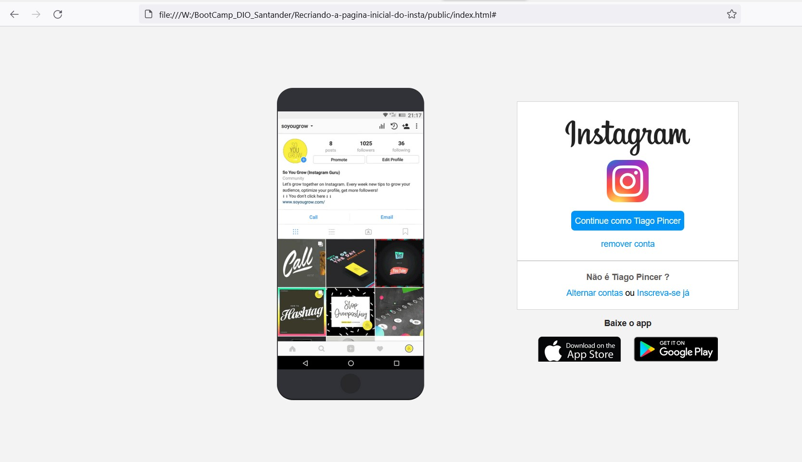

<h1 align="center"> Recriando a pagina inicial do instagram </h1>

   

  <a href="https://www.linkedin.com/in/tiago-pincer-b48a11174/">
    

  

Este é um projeto feito pela digital innovation one e adaptado por mim, dentro deste projeto foi transpassado lições sobre : HTML5 e CSS3. 

<h2>Principais tópicos abordados</h2>
<ul align="left">
  <li>hierarquia de tags</li>
  <li>flex-layout</li>
  <li>grid-layout</li>
  <li>css tricks</li>
</ul>

